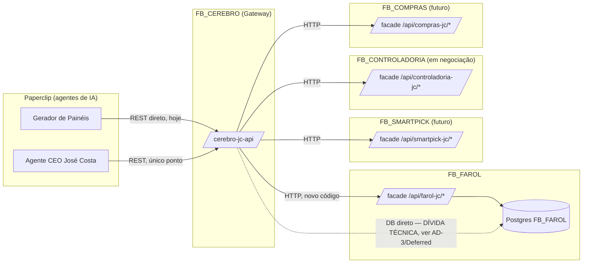

# Architecture Spine — Integração Multi-Módulo FB (Agentes de IA / Gateway CEO)

## Design Paradigm

**BFF-for-Agents + Gateway de Agregação.**

Cada módulo FB_* é dono do seu domínio e expõe seu próprio **facade HTTP
read-only pra agentes de IA** — um "Backend-for-Frontend" onde o
"frontend" é o agente, não um humano numa SPA. Esse facade vive dentro
do próprio backend do módulo (mesmo processo, mesma base de código),
namespace `/api/<modulo>-jc/*`, separado da API interna que o módulo já
tem pro seu próprio frontend humano.

Um segundo papel, **Gateway de Agregação** (hoje `cerebro-jc-api`,
promovido nesta espinha a serviço próprio **FB_CEREBRO**), é o ÚNICO
ponto que agentes multi-módulo (o futuro agente de monitoramento do CEO)
chamam — ele NUNCA calcula nada por conta própria pra dado que já
pertence a outro módulo, só agrega chamando o facade de cada um (AD-3).



## Invariants & Rules

### AD-1 — Cada módulo expõe seu próprio facade agent-facing

- **Binds:** todos os módulos FB_* (FB_FAROL, FB_SMARTPICK, FB_CONTROLADORIA, FB_COMPRAS)
- **Prevents:** módulo A reimplementando ou duplicando lógica de cálculo que já existe no módulo B, gerando duas fontes de verdade pro mesmo número
- **Rule:** todo dado exposto pra agente de IA passa pelo facade HTTP do módulo DONO daquele dado (`/api/<modulo>-jc/*`), nunca calculado de novo em outro módulo ou no Gateway. **Desempate de dono:** quando dois módulos poderiam reivindicar o mesmo conceito de negócio (ex.: "faturado" — pode ser venda transmitida pra um módulo e receita reconhecida pra outro), o dono é o módulo que tem o **dado bruto** na própria base — não quem primeiro implementa. Um conflito real de nomenclatura entre dois módulos vira uma decisão explícita nova nesta espinha (`AD` novo), nunca resolvido implicitamente por quem chegou primeiro. Um glossário de domínio formal (todo conceito de negócio → módulo dono) fica em Deferred — hoje só FB_FAROL existe de fato, então ainda não há conflito real pra resolver.

### AD-2 — FB_CEREBRO é o único ponto de entrada multi-módulo

- **Binds:** agente de monitoramento do CEO José Costa; qualquer agente que precise combinar dado de 2+ módulos
- **Prevents:** um agente cross-módulo precisar conhecer N URLs/tokens diferentes; lógica de agregação espalhada em vários agentes de IA em vez de um lugar testável
- **Rule:** agente que consulta mais de um módulo chama SÓ o FB_CEREBRO. Agente que consulta um único módulo (ex.: Objetivos por Indústria hoje) pode chamar o facade do módulo direto — não é obrigado a passar pelo Gateway. **Limite reconhecido:** esta regra é convenção de uso documentada em cada AGENTS.md, não uma trava técnica — nenhum dos serviços hoje distingue "chamada veio do Gateway" de "chamada veio direto de um agente" (mesmo token serve pros dois). Se isso precisar de enforcement (rate-limit por chamador, auditoria de quem chamou o quê), é uma decisão futura — ver Deferred.

### AD-3 — Ninguém acessa banco de outro módulo direto, só via HTTP

- **Binds:** todos os módulos FB_*, e o Gateway FB_CEREBRO
- **Prevents:** acoplamento silencioso a schema interno de outro módulo (uma migration no FB_FAROL quebrando quem quer que leia direto, sem nenhum contrato/teste entre os dois repos); e trava a expansão pra módulos que não compartilham banco (FB_CONTROLADORIA/FB_COMPRAS podem ter Postgres próprio)
- **Rule:** todo código NOVO (em qualquer módulo, ou no Gateway) só acessa dado de outro módulo via o facade HTTP dele (AD-1) — nunca conecta direto no Postgres de outro módulo. **Dívida técnica nomeada explicitamente:** o `cerebro-jc-api` hoje lê o Postgres do FB_FAROL direto em **três** rotas — `/resumo`, `/cobertura` (Painel de Cobertura) e `/faturado-fornecedor` (Painel de Faturado) — todas mantidas nesta rodada pra não quebrar o que já funciona (ver Deferred). A rota nova de Objetivos por Indústria já nasce certa: chama o facade do FB_FAROL via HTTP.

### AD-4 — Convenção única de período em todos os facades

- **Binds:** todos os módulos, FB_CEREBRO
- **Prevents:** cada módulo novo inventando seu próprio formato de data (ISO 8601 puro, timestamp, etc.), forçando o agente de IA a aprender N formatos; ou dois módulos entendendo "2026-08" como janelas de dado diferentes
- **Rule:** todo parâmetro de período aceita `"AAAA-MM"` OU `"DD/MM/AAAA a DD/MM/AAAA"` — mesmo parser já validado em `FB_FAROL` (`parsePeriodo`). `"AAAA-MM"` significa sempre o **mês civil inteiro** (dia 1 ao último dia daquele mês), no fuso `America/Sao_Paulo` — mesmo fuso operacional que todos os serviços já usam hoje, nunca UTC nem uma janela corrida de 30 dias.

### AD-5 — Envelope de resposta e erro padronizado

- **Binds:** todos os módulos, FB_CEREBRO
- **Prevents:** um agente de IA precisar tratar formato de sucesso/erro/valor monetário diferente por módulo, ou fazer unwrap bespoke por chamada
- **Rule:** JSON em `snake_case` (`cod_fornec`, `venda_atual`, `industria`, etc.). Resposta de sucesso de endpoint **novo** é sempre um objeto JSON no nível raiz (nunca um array solto) — os 3 endpoints legados do `cerebro-jc-api` que já devolvem array bruto (`/cobertura`, e o campo `fornecedores` dentro do objeto de `/faturado-fornecedor`) são exceção ratificada, não modelo a copiar. Valor monetário é sempre `float64` em **reais** (nunca centavos inteiros, nunca string formatada) — convenção já em uso nos dois serviços. Erro sempre `{"error": "mensagem"}` com status HTTP correspondente (400 validação, 401 auth, 500 interno).

### AD-6 — Auth: token Bearer estático por chamador, nunca por request

- **Binds:** todos os módulos, FB_CEREBRO
- **Prevents:** vazamento de escopo entre empresas (um agente passando `empresa_id` livre); token acabando em texto puro num AGENTS.md (já aconteceu uma vez nesta plataforma); e o design inseguro de "revogar o Gateway revoga também o agente direto" que um único token forçaria
- **Rule:** cada serviço lê seu(s) token(s) Bearer de env var(s) no boot — pode ter **mais de um token válido por serviço** (ex.: um pro Gateway, outro pro agente que chama direto), desde que cada token seja single-purpose (mapeado a um único chamador/escopo) e nenhum token venha do corpo/query da request. Instrução de agente (AGENTS.md) referencia só o NOME da env var, nunca o valor literal do token. **Exceção deliberada e agora explícita:** a rota `GET /painel` do `cerebro-jc-api` (dashboard HTML ao vivo, referenciado como link direto por humano — ver AD-7) não exige token, porque não é uma chamada de agente, é uma URL clicável; toda rota que devolve DADO (JSON) exige auth, sem exceção.

### AD-7 — Entrega de painel é sempre por e-mail, gerado server-side

- **Binds:** qualquer módulo que produza um "painel" pra um agente de IA entregar a um humano, quando a entrega é um relatório pontual (ponto no tempo, "manda isso pro fulano agora")
- **Prevents:** depender do agente de IA gerar HTML e anexar numa issue do Paperclip — mecanismo observado como instável (arquivo gerado corretamente, mas o anexo real nunca acontecia, arquivo ficava em `/tmp` efêmero e se perdia)
- **Rule:** o módulo dono do dado monta o HTML e manda por e-mail direto (SMTP), numa rota tipo `/api/<modulo>-jc/<recurso>-email?...&email=` (mesmo prefixo namespaced do AD-1 — não existe rota de e-mail fora do facade do módulo). O agente de IA só CHAMA essa rota e confirma o envio — nunca gera nem tenta anexar arquivo. Mesma conta SMTP (Hostinger, credenciais já configuradas) reaproveitada por todos os módulos via env vars — mas cada módulo implementa seu próprio sender pequeno (sem lib compartilhada entre repos, que podem ser linguagens diferentes). **Não conflita com** o `GET /painel` do `cerebro-jc-api`: aquilo é um **link permanente pra um dashboard ao vivo** (busca dado toda vez que é aberto), um mecanismo diferente de "mandar um relatório pontual" — os dois padrões coexistem, cada um pro seu caso de uso, e um módulo novo escolhe qual dos dois faz sentido pro seu painel, não inventa um terceiro.

### AD-8 — Deploy só via git + CI/CD, nunca build manual em produção

- **Binds:** todos os módulos, FB_CEREBRO
- **Prevents:** perder rollback/histórico (o estado atual do `cerebro-jc-api`: binário buildado manualmente no host, sem git, sem forma segura de reverter uma mudança ruim)
- **Rule:** todo serviço da plataforma é um app Coolify git-based — push pro branch `main` dispara build+redeploy automático. Nenhum `docker build`/`docker run` manual em produção fora desse fluxo.

### AD-9 — Nível de teste por tipo de lógica

- **Binds:** todos os módulos, FB_CEREBRO
- **Prevents:** suíte de teste que só roda com banco real disponível (esconde regressão de lógica pura atrás de "precisa de infra pra testar")
- **Rule:** lógica pura (parsing de período, montagem de HTML de e-mail, roteamento/validação) tem teste de unidade sem NENHUMA dependência externa (sem DB, sem rede, sem outro módulo). Chamada real a banco ou a outro módulo via HTTP é teste de integração, gated por env var — ausente, o teste pula (nunca falha o build), mesma convenção já em uso no FB_FAROL. Classificar uma função como "lógica pura" quando ela na verdade depende de estado externo (ex.: hora atual sem injeção, ordem de mapa) é um code-review issue, não uma exceção a esta regra.

### AD-10 — Cutover do cerebro-jc-api pro FB_CEREBRO (git + CI/CD)

- **Binds:** a migração específica do `cerebro-jc-api` (objetivo imediato desta rodada)
- **Prevents:** downtime ou perda de configuração no corte — o processo manual hoje rodando em produção (`/opt/cerebro-jc`, sem git) não pode simplesmente ser desligado às cegas
- **Rule:** (1) criar o repositório FB_CEREBRO com o código atual + as rotas novas (email, proxy Objetivos por Indústria); (2) subir o app Coolify git-based numa **porta/rota alternativa** primeiro (não a mesma porta 8090 do processo manual — evita conflito e permite os dois rodarem lado a lado); (3) migrar as env vars pro app Coolify (`API_TOKEN`, `DATABASE_URL`, + `SMTP_*` novas, + o token do FB_FAROL pro proxy de Objetivos por Indústria); (4) validar as rotas contra o novo container; (5) só então trocar o rótulo Traefik (`cerebro-jc-api.fbtechia.com`) pra apontar pro novo container; (6) manter o container antigo **parado, não removido**, por um período de segurança antes de descartar de vez.

### AD-11 — Health-check obrigatório em todo serviço

- **Binds:** todos os módulos, FB_CEREBRO
- **Prevents:** silêncio total sobre o envelope operacional — cada serviço novo decidindo (ou esquecendo) sua própria convenção de saúde
- **Rule:** todo serviço expõe `GET /health` (ou `/api/health`, mesmo padrão já em uso no FB_FAROL) sem autenticação, respondendo o status da dependência crítica (ex.: ping no banco) ou simplesmente "ok" se o serviço não tiver estado. Monitoramento/alertas ativos (quem observa esse endpoint e avisa alguém) fica em Deferred — ferramenta ainda não escolhida.

## Consistency Conventions

| Concern | Convention |
| --- | --- |
| Naming (rotas) | `/api/<modulo>-jc/<recurso>` pro facade de cada módulo; `/api/<modulo>-jc/<recurso>-email` pra variante que entrega por e-mail (mesmo prefixo, sem exceção — ver AD-1/AD-7); `/health` sem prefixo (AD-11) |
| Data & formatos | período: `AAAA-MM` (mês civil, `America/Sao_Paulo`) ou `DD/MM/AAAA a DD/MM/AAAA` (AD-4); JSON `snake_case`, sucesso sempre objeto no topo, valor monetário `float64` em reais (AD-5); erro `{"error": "..."}` |
| State & cross-cutting | auth Bearer por chamador via env var, N tokens por serviço permitido (AD-6); e-mail sempre server-side pra relatório pontual, dashboard ao vivo é padrão separado (AD-7); deploy só via git+CI/CD (AD-8); health-check obrigatório (AD-11) |

## Stack

| Name | Version | Source |
| --- | --- | --- |
| Go (FB_FAROL) | 1.26.1 | `backend/go.mod`, lido local |
| Go (cerebro-jc-api / FB_CEREBRO) | 1.22 — **fora da janela oficial de suporte do Go (ver Deferred)** | `/opt/cerebro-jc/go.mod`, lido via SSH no host de produção |
| github.com/jackc/pgx/v5 (FB_CEREBRO, driver Postgres) | v5.5.5 | idem |
| github.com/lib/pq (FB_FAROL, driver Postgres) | v1.11.2 | `backend/go.mod` |
| github.com/modelcontextprotocol/go-sdk (FB_FAROL, servidor MCP — existe, não é o caminho de integração ativo) | v1.8.0 | `backend/go.mod` |
| Postgres (compartilhado FB_FAROL ↔ FB_CEREBRO hoje) | — | mesma instância, ver AD-3 sobre isso ser dívida técnica |
| Coolify (deploy) | instância própria já em uso pro FB_FAROL | observado em produção |
| SMTP (Hostinger) | já configurado, reaproveitado por todos os módulos | env vars em produção, confirmado funcionando |

## Structural Seed

```text
FB_CEREBRO/                       # novo repo (era /opt/cerebro-jc, sem git)
  main.go                         # HTTP handlers + queries diretas (legado: /resumo, /cobertura, /faturado-fornecedor)
  painel-fornecedor.html          # painel ao vivo (embed) — GET /painel, sem auth, AD-6/AD-7
  Dockerfile                      # já existe, ratificado
  go.mod                          # atualizar Go 1.22 → versão suportada durante o cutover (AD-10)
  internal/
    email/                        # sender SMTP próprio deste serviço (AD-7)
    farolclient/                  # cliente HTTP fino pro facade do FB_FAROL (AD-3)

FB_FAROL/backend/handlers/
  farol_jc_rest.go                # facade /api/farol-jc/* (já existe)
  farol_jc_email.go               # entrega por e-mail (já existe, referência de padrão)
  farol_mcp.go                    # servidor MCP real — mantido, não é o caminho ativo
```

## Deferred

- **Migrar as rotas legadas do Gateway (`/resumo`, `/cobertura`, `/faturado-fornecedor`) de leitura direta no Postgres do FB_FAROL pra chamada HTTP contra um facade equivalente no FB_FAROL.** Não faz parte desta rodada — só a rota nova (Objetivos por Indústria) precisa nascer certa (AD-3). Revisitar quando o FB_FAROL expuser os facades equivalentes (hoje não existem).
- **Atualizar o Go do FB_CEREBRO (1.22, fora da janela oficial de suporte) pra uma versão atual** — fazer isso durante o cutover do AD-10, não como projeto separado depois.
- **Glossário de domínio formal** (todo conceito de negócio → módulo dono, ex.: "faturado", "cliente ativo") — hoje só FB_FAROL existe de verdade, sem conflito real ainda; criar quando FB_CONTROLADORIA ou FB_COMPRAS nascerem e um conflito de nomenclatura aparecer de fato.
- **Enforcement técnico de "quem chamou"** (distinguir Gateway de agente direto no AD-2, rate-limit por chamador) — hoje é só convenção documentada; formalizar se virar necessário.
- **Quota/política de remetente do SMTP compartilhado** entre múltiplos módulos mandando e-mail pela mesma conta — sem volume real ainda pra justificar a regra.
- **Onde exatamente FB_CONTROLADORIA e FB_COMPRAS vão morar** (schema de banco próprio ou compartilhado) — em negociação, sem decisão a tomar agora. Assumido apenas que, quando existirem, herdam AD-1/AD-3 (facade próprio, nunca acessa banco de outro módulo direto).
- **Desenho do agente de monitoramento do CEO José Costa em si** (quais perguntas ele responde, que dado agrega de quais módulos) — fora do escopo desta espinha, que só fixa COMO os módulos conversam entre si, não O QUE o agente do CEO pergunta.
- **Monitoramento/alertas ativos sobre o `/health` de cada serviço (AD-11)** — endpoint é obrigatório agora, quem observa e avisa alguém ainda não foi escolhido.
- **Se o servidor MCP real (`farol_mcp.go`, `/api/mcp`) deve ser aposentado** — hoje coexiste sem uso ativo. Não decidido nesta rodada; não atrapalha nada mantido como está.
